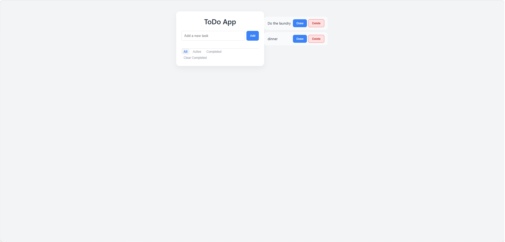

# Todo App v2.5

A modern, interactive Todo application built with HTML, CSS and JavaScript.

This project demonstrates strong foundational front-end skills, including DOM manipulation, event handling, state management, and working with Web Storage APIs.

## Features

- **Task Management:** Add new tasks, mark them as completed, or delete them.
- **Task Filtering (V2.5):** Quickly switch between "All", "Active", and "Completed" tasks.
- **Bulk Actions (V2.5):** "Clear completed" button to quickly clean up the list.
- **Data Persistence:** Tasks are saved in `localStorage` and restored automatically upon page reload.
- **Legacy data migration:** Built-in automatic conversion of old v1 data formats (strings) to v2 formats (objects).
- **Accessibility (A11y):** Form inputs are labeled correctly for screen readers using `.sr-only` techniques.
- **Responsive design:** Fluid layout optimized for both desktop and mobile devices using CSS variables for easy theming.
- **UX Improvements:** Support for "Enter" key submission and an "Empty State" UI when no tasks are present.

## Technologies

- HTML5
- CSS3 (Custom Properties / Variables, Flexbox)
- JavaScript (ES6+)
- `localStorage` API

## Project Goal

This project was developed as a portfolio piece to practice and showcase:
1. Clean UI/UX implementation without frameworks.
2. Separation of concerns (handling data state vs. UI rendering).
3. Advanced array methods (`filter`, `map`, `forEach`).

## Live Demo

[Open Project](https://stellular-shortbread-c29e2f.netlify.app/)

## Screenshot

## Changelog

### V2.5

- Added filtering system (All, Active, Completed).
- Added "Clear completed" functionality.
- Added explicit visual Empty State.
- Improved Accessibility with hidden `<label>` tags.

### V2.0

- Migrated task data structure from simple strings to complex objects.
- Extracted design system into CSS Variables.
- Polished UI interactions and hover states.